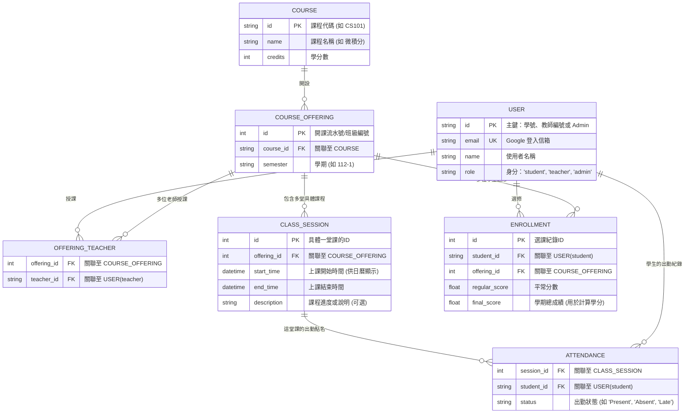

# 選課系統資料庫 (Database Schema) 設計計畫 V2

根據您的回饋，我進行了以下調整：
1. **確認使用 SQLite 搭配 SQLAlchemy** 來實作資料庫。
2. **新增 Admin (管理員) 角色**：管理員可以透過專屬介面將老師的 Email 加入系統。
3. **優化不固定授課時間與出勤紀錄**：將單一的字串 `schedule` 移除，改為新增 `CLASS_SESSION` (具體的上課日誌/行程) 資料表，這樣就可以精確在日曆上畫出每一堂課，並且新增 `ATTENDANCE` (出勤表) 來紀錄每一堂課學生的出缺席。另外在 `ENROLLMENT` 中新增了 `regular_score` (平常分) 欄位。

## ER 模型 (實體關聯圖)

## 資料表詳細說明 (新增與修改的部分)

### 1. `USER` (身分擴充)
*   **`role`**: 現在有三種：`student`, `teacher`, `admin`。
*   **管理員介面**：只有 `role == 'admin'` 的人，登入後能看到「管理介面」，用來新增老師的 Email 到系統中。

### 2. `CLASS_SESSION` (具體上課行程 - 解決日曆與不固定時間問題)
一門課（如微積分 112-1）可能會在上學期上 18 週，每週上課時間甚至可能調課。所以我們把「每次上課」獨立成一筆紀錄：
*   **`start_time` / `end_time`**: 標記這堂課的確切時間。
*   **日曆應用**：前端可以透過抓取這個 Table 的資料，直接繪製成 Calendar 視圖給學生或老師看。

### 3. `ATTENDANCE` (出勤表 - 解決點名問題)
*   **`session_id` & `student_id`**: 紀錄「哪位學生」在「哪一天的哪堂具體課程」的出缺席狀況。老師可以在某堂 `CLASS_SESSION` 結束後，批次更新該堂課的 `ATTENDANCE`。

### 4. `ENROLLMENT` (修課與成績紀錄表 - 解決平常分問題)
*   **`regular_score`**: 紀錄該學生這門課的平時成績總結。
*   **`final_score`**: 學期末計算出的最終成績，用來判定是否取得學分。

## User Review Required

> [!IMPORTANT]
> **最後確認**
> 這個架構將單一課程拆解成了一堂一堂的 `CLASS_SESSION`，這樣就能完美支援您的**日曆行程表**以及**單堂出勤紀錄**需求，同時也加入了管理員的角色。
> 請您確認這個新架構是否更符合您的預期？如果沒問題，請點擊 **Proceed**，我就會開始用 SQLite + SQLAlchemy 幫您建置 Model 與初始化腳本！
